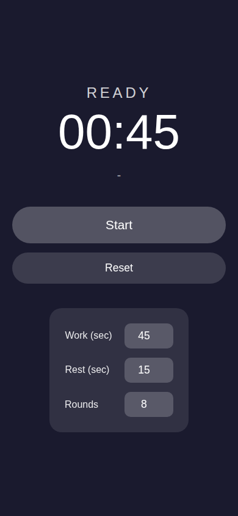
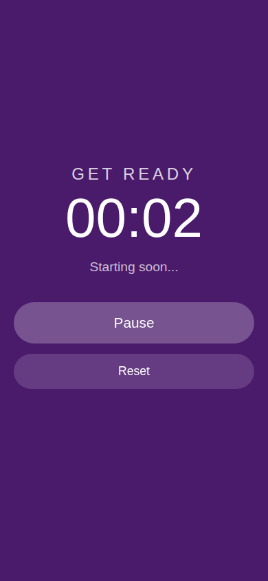
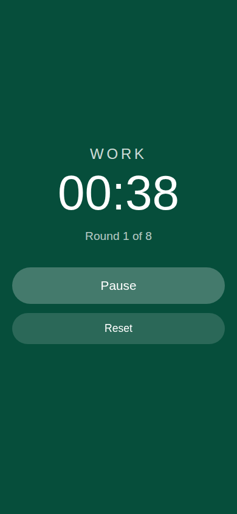
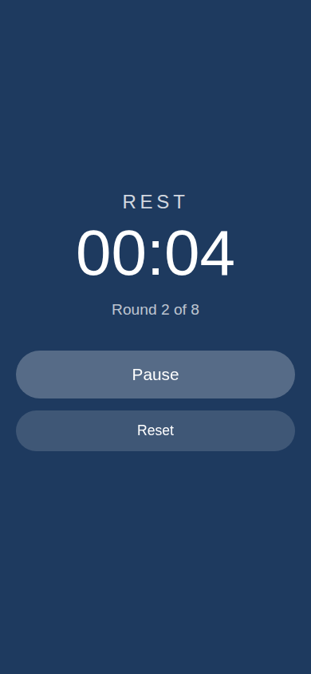

# Workout Timer

A minimal, offline-capable interval timer PWA for workouts.

**[Launch App →](https://workout-timer-chi-jade.vercel.app)**

## Features

- ⏱️ **Work/Rest intervals** with configurable durations
- 🎨 **Visual phases** — purple (warmup), green (work), blue (rest)
- 🔊 **Audio cues** — countdown beeps and phase transition sounds
- 📱 **PWA** — install on your phone, works offline
- ⚡ **Zero dependencies** — pure HTML/JS/CSS, no build step

## Screenshots

| Ready | Warmup | Work | Rest |
|:-----:|:------:|:----:|:----:|
|  |  |  |  |

## Default Settings

- **Work:** 45 seconds
- **Rest:** 15 seconds  
- **Rounds:** 8
- **Warmup:** 5 seconds (before first round)

All configurable in the app.

## Install as PWA

1. Open the app in Safari (iOS) or Chrome (Android)
2. Tap Share → "Add to Home Screen" (iOS) or the install prompt (Android)
3. Launch from your home screen — works offline!

## Tech

- Web Audio API for sound generation (no audio files needed)
- Service Worker for offline caching
- Manifest for PWA install

## License

MIT
